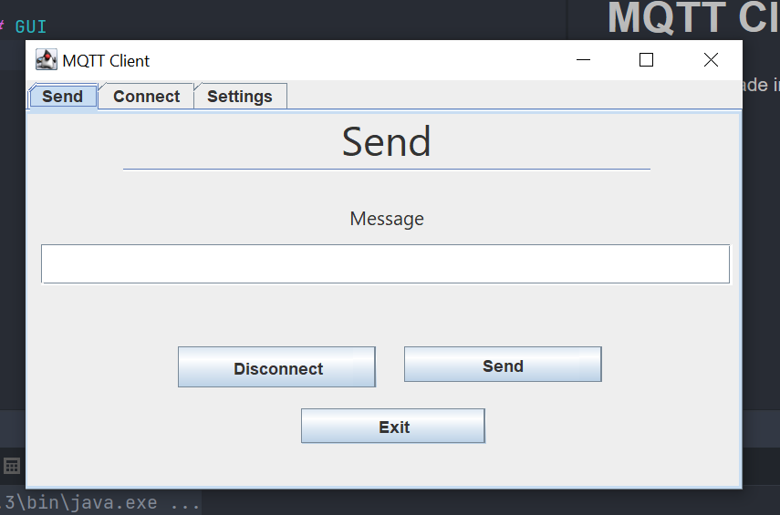
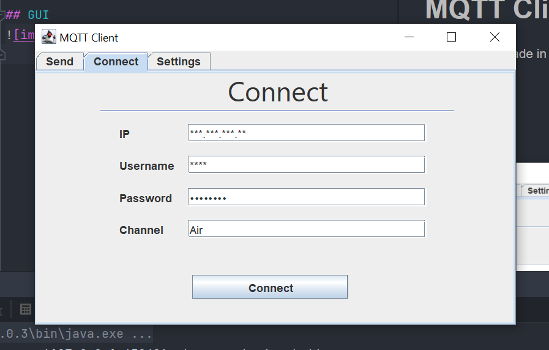
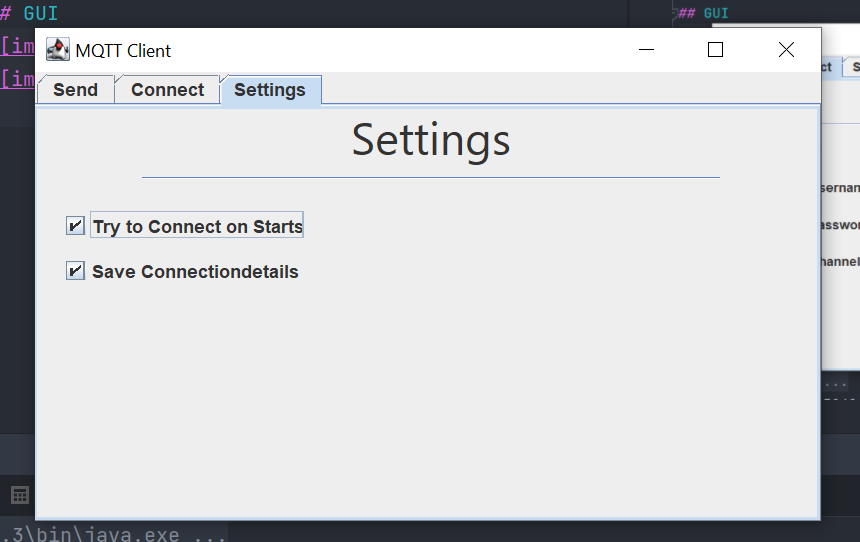

# MQTT Client
MQTT Client made in [Java 17](https://www.oracle.com/java/technologies/downloads/#java17) and [Kotlin](https://kotlinlang.org) using [JFrame](https://docs.oracle.com/en/java/javase/17/docs/api/java.desktop/javax/swing/JFrame.html)

## GUI

